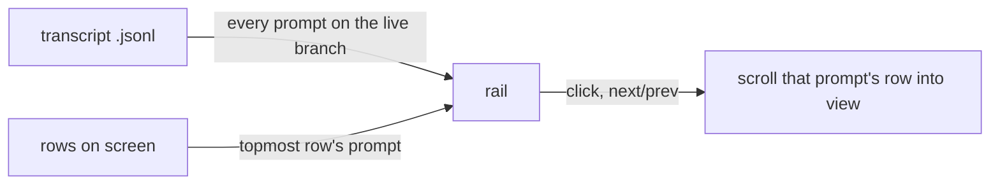

<div align="center">

# prompt-rail

A rail of your prompts for Claude Code. Hover to read one, click to jump back to it.


</div>

## Quick start

1. Turn on function hooks (early access, Claude Code 2.1.280+) in `~/.claude/settings.json`:

   ```json
   { "env": { "CLAUDE_CODE_ENABLE_FUNCTION_HOOKS": "1" } }
   ```

2. Install, from your shell or inside a session:

   ```bash
   claude plugin marketplace add oikon48/prompt-rail
   claude plugin install prompt-rail@oikon48
   ```

   ```
   /plugin marketplace add oikon48/prompt-rail
   /plugin install prompt-rail@oikon48
   ```

3. Start a new session. The rail opens on its own.

Mouse works best with `"tui": "fullscreen"`.

## Two layouts

### Horizontal, above the prompt (default)


### Vertical, beside the transcript


## Commands

| Command | |
| --- | --- |
| `/prompt-rail horizontal` | Bars above the prompt input |
| `/prompt-rail vertical` | A pane beside the transcript |
| `/prompt-rail off` | Hide the rail |
| `/prompt-rail next` | Jump to the next prompt |
| `/prompt-rail prev` | Jump to the previous prompt |
| `/prompt-rail first`, `last` | Jump to the first or the newest prompt |
| `/prompt-rail 12`, `#12` | Jump to prompt #12 |
| `/prompt-rail find <words>` | Jump to the newest prompt that holds the words |
| `/prompt-rail-next`, `/prompt-rail-prev` | Jump to the next or previous prompt, with no argument, for a keybinding |
| `/prompt-rail` | Reopen the rail in the current layout |

The layout is also the "Rail mode" row in `/config`, and it is kept across sessions.

### Keyboard

Bind the step commands in `~/.claude/keybindings.json`; they run mid-turn too:

```json
{
  "bindings": [
    { "context": "Chat", "bindings": { "ctrl+k": "command:prompt-rail-prev", "meta+j": "command:prompt-rail-next" } }
  ]
}
```

In the horizontal layout, `ctrl+x tab` moves the focus to the bars: the ring starts on the prompt you are reading, `←` `→` move it across the bars on screen and show its prompt, `Enter` jumps there, `Esc` returns to the prompt input.

## Tick legend

| Tick | Meaning |
| --- | --- |
| `━` `▌` | The prompt you are reading |
| `─` `▎` | Any other prompt |
| `┄` `┆` | A prompt Claude Code refused to scroll to; `next` and `prev` skip it |

## How it works

<details>
<summary>From the transcript file to the rail</summary>



The rail lists the prompts of the live branch, so prompts abandoned with `/rewind` drop out, and prompts from before a resume are listed too. The prompt you are reading owns the topmost row on screen. The transcript is read again only when its size or time changed.

</details>

## Limitations

<details>
<summary>Known limits</summary>

- Function hooks are early access, and their API may change between Claude Code releases.
- The hover card with the turn summary is part of the horizontal rail.
- The Claude desktop app draws the horizontal rail and its hover cards, but a click cannot jump there. The app gives a plugin no way to scroll its transcript, so the rail says so once a session. The prompt being read is named beside the bars rather than on the line above them, since the app paints a card over that line without hiding what is under it. Checked with Claude Code 2.1.280, the app did not draw the vertical pane.
- The dock width is shared by all plugin panes; drag its edge to narrow it, down to 24 columns.
- A `/compact` command's own row cannot be jumped to; its tick turns dotted after the first try.
- Near the end of the transcript, `next` cannot scroll further.

</details>

## Development

```bash
claude --plugin-dir plugins/prompt-rail        # load this checkout; saving reloads it
claude plugin validate plugins/prompt-rail
claude plugin test plugins/prompt-rail
```

Run `/plugin-types .claude/types` in a session here for type declarations. Bump the version in `plugins/prompt-rail/.claude-plugin/plugin.json` with each release, since installed copies update only when it changes.

## License

[MIT](LICENSE)
